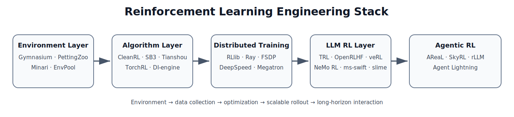
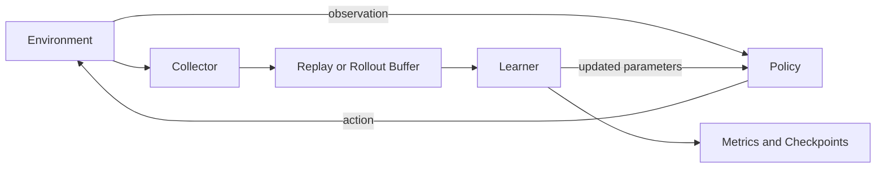
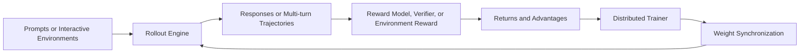

# Reinforcement Learning Engineering Stack

> A practical map of environments, algorithm implementations, distributed RL systems, LLM post-training frameworks, and agentic reinforcement learning.


This repository is intended for researchers and engineers who need to:

- choose an RL software stack;
- understand how major tools fit together;
- compare classical RL and LLM RL infrastructure;
- prepare a technical report on modern RL engineering;
- identify useful learning materials and implementation references.



## Contents

- [Why this guide exists](#why-this-guide-exists)
- [TL;DR](#tldr)
- [The engineering stack](#the-engineering-stack)
- [Repository layout](#repository-layout)
- [Framework landscape](#framework-landscape)
- [How to choose](#how-to-choose)
- [Major trends](#major-trends)
- [Evaluation checklist](#evaluation-checklist)
- [Using this repository](#using-this-repository)
- [Citation](#citation)
- [License](#license)

## Why this guide exists

RL tools are often presented as one flat list even though they solve different problems.

For example:

- **Gymnasium** defines an environment interface.
- **CleanRL** provides readable algorithm implementations.
- **Stable-Baselines3** provides reliable baselines.
- **TorchRL** provides composable PyTorch primitives.
- **RLlib** manages distributed RL workloads.
- **vLLM** and **SGLang** accelerate language-model rollouts.
- **veRL**, **OpenRLHF**, and **NeMo RL** orchestrate distributed LLM reinforcement learning.
- **AReaL**, **SkyRL**, **rLLM**, and **Agent Lightning** address asynchronous and long-horizon agent training.

The useful question is not “Which RL library is best?” It is:

> Which combination of environment, algorithm, rollout, training, orchestration, and evaluation components fits the target workload?

## TL;DR

| Goal | Recommended starting point |
|---|---|
| Learn how RL algorithms work | Gymnasium + CleanRL |
| Obtain a reliable classical baseline | Stable-Baselines3 |
| Develop new classical RL algorithms | Tianshou or TorchRL |
| Build broad configurable RL pipelines | DI-engine |
| Scale classical RL across environments or nodes | RLlib or Sample Factory |
| Run small LLM alignment experiments | Hugging Face TRL |
| Use a low-code fine-tuning interface | LLaMA-Factory |
| Run broad LLM/VLM GRPO-family workflows | ms-swift |
| Scale Hugging Face models with Ray, DeepSpeed, and vLLM | OpenRLHF |
| Research flexible RLHF/RLVR systems | veRL |
| Use NVIDIA, FSDP2, or Megatron Core | NeMo RL |
| Combine Megatron training with SGLang rollouts | slime |
| Study fully asynchronous LLM RL | AReaL |
| Train long-horizon tool-using agents | SkyRL, rLLM, or Agent Lightning |

## The engineering stack

### Classical RL



A classical RL stack usually contains:

- an environment API;
- vectorized or parallel environments;
- trajectory collection;
- a replay or rollout buffer;
- return and advantage estimation;
- policy and value losses;
- evaluation and checkpointing;
- optional distributed actors and learners.

### RL for LLMs



LLM RL adds several systems problems:

- high-throughput token generation;
- actor, reference, critic, and reward-model placement;
- FSDP, DeepSpeed, or Megatron parallelism;
- vLLM or SGLang rollout engines;
- training-to-inference weight synchronization;
- long and variable-duration trajectories;
- verifiers, sandboxes, and tool environments;
- synchronous versus asynchronous execution.

## Repository layout

```text
rl-engineering-stack/
├── README.md
├── LICENSE
├── CITATION.cff
├── .markdownlint.json
├── docs/
│   ├── classical-rl.md
│   ├── distributed-rl.md
│   ├── llm-rl.md
│   ├── agentic-rl.md
│   └── learning-resources.md
└── assets/
    └── rl-stack-overview.svg
```

| Document | Focus |
|---|---|
| [Classical RL](docs/classical-rl.md) | Gymnasium, PettingZoo, Minari, EnvPool, CleanRL, Stable-Baselines3, Tianshou, TorchRL, and DI-engine |
| [Distributed RL](docs/distributed-rl.md) | RLlib, Sample Factory, PARL, Ray, vLLM, SGLang, FSDP, DeepSpeed, and Megatron |
| [RL for LLMs](docs/llm-rl.md) | RLHF, RLVR, TRL, LLaMA-Factory, ms-swift, OpenRLHF, veRL, NeMo RL, slime, and DeepSpeed-Chat |
| [Agentic RL](docs/agentic-rl.md) | AReaL, SkyRL, rLLM, Agent Lightning, asynchronous rollout, and long-horizon agents |
| [Learning Resources](docs/learning-resources.md) | Curated materials, learning paths, and a 25–30 minute advisor-report outline |

## Framework landscape

| Layer | Representative tools | Main responsibility |
|---|---|---|
| Environment standards | Gymnasium, PettingZoo | Reset, step, observations, actions, and episode boundaries |
| Offline datasets | Minari | Package and version offline trajectories |
| High-speed environments | EnvPool | Increase environment-step throughput |
| Minimal implementations | CleanRL, Spinning Up, Dopamine | Make algorithm logic readable |
| General RL libraries | Stable-Baselines3, Tianshou, TorchRL, DI-engine | Reusable algorithms, collectors, buffers, and trainers |
| Distributed classical RL | RLlib, Sample Factory, PARL | Scale actors, environments, learners, and experiments |
| Trainer-first LLM alignment | TRL, LLaMA-Factory, ms-swift | SFT, reward modeling, preference training, and selected online RL |
| Distributed LLM RL | OpenRLHF, veRL, NeMo RL, slime | Rollout, model placement, distributed training, and weight synchronization |
| Agentic and asynchronous RL | AReaL, SkyRL, rLLM, Agent Lightning | Multi-turn environments, tools, asynchronous rollout, and long-horizon training |
| Inference and rollout | vLLM, SGLang | High-throughput generation and KV-cache management |
| Training backends | FSDP/FSDP2, DeepSpeed, Megatron Core | Parameter, gradient, optimizer, tensor, pipeline, and expert parallelism |
| Orchestration | Ray | Resource allocation, worker lifecycle, placement, and failure handling |
| Tracking | Weights & Biases, TensorBoard, MLflow | Metrics, artifacts, and reproducibility |

## How to choose

### Choose Gymnasium + CleanRL when

- the team is learning RL;
- algorithm details must be audited;
- a paper implementation will be modified;
- transparent debugging matters more than framework reuse.

### Choose Stable-Baselines3 when

- a trustworthy baseline is needed quickly;
- a custom environment requires a sanity check;
- algorithm novelty is not the main contribution.

### Choose Tianshou or TorchRL when

- buffers, collectors, and transforms should be reused;
- several related algorithms will be developed;
- the project must remain PyTorch-native.

### Choose RLlib when

- the workload spans many environments or multiple nodes;
- multi-agent training is central;
- Ray is already part of the infrastructure;
- fault tolerance and cluster scheduling matter.

### Choose TRL when

- the experiment starts from Hugging Face models;
- the main goal is testing an objective or reward function;
- LoRA or QLoRA matters;
- cluster-level rollout architecture is not the main research question.

### Choose OpenRLHF when

- DeepSpeed and vLLM are preferred;
- explicit Ray-based placement is acceptable;
- PPO, GRPO, or multi-turn RL must scale beyond a simple trainer.

### Choose veRL when

- both algorithms and distributed systems are research targets;
- FSDP and Megatron options are valuable;
- rollout backends may change;
- reasoning RL or RLVR is central.

### Choose NeMo RL when

- the team already uses NVIDIA containers or Megatron Core;
- the model is very large, multimodal, long-context, or mixture-of-experts;
- hardware efficiency dominates ease of setup.

### Choose an agentic RL layer when

- trajectories contain multiple tool calls;
- environment execution time varies greatly;
- training and evaluation need the same agent harness;
- credit assignment spans an entire workflow.

## Major trends

### Critic-free and reduced-critic methods

A full PPO stack may require a critic comparable in size to the policy. GRPO, RLOO, and REINFORCE-family methods reduce or eliminate that component, trading model cost for greater sensitivity to baseline construction and reward variance.

### Rollout is a first-class systems problem

Long responses, multiple samples per prompt, tool latency, program execution, and verifier time can dominate wall-clock training. The rollout service is no longer a small call to `generate()`.

### Asynchronous execution is becoming more important

Synchronous RL improves policy freshness but creates barriers. Asynchronous systems improve utilization but introduce stale trajectories. The central trade-off is:

```text
throughput versus policy freshness
```

### Trainer and rollout services are separating

Modern stacks increasingly isolate:

- optimization and distributed gradients;
- generation and environment interaction;
- verification and sandbox execution;
- weight synchronization and model serving.

### Agent execution is becoming its own layer

Mature agentic RL requires environment protocols, tool schemas, process isolation, timeouts, trajectory versioning, deterministic replay where possible, and consistent training/evaluation harnesses.

## Evaluation checklist

Do not report throughput alone. Track both learning and systems outcomes.

| Category | Suggested metrics |
|---|---|
| Learning | reward, pass rate, success rate, sample efficiency, stability |
| Rollout | tokens/s, episodes/s, latency percentiles, truncation rate |
| Training | step time, throughput, scaling efficiency, gradient norms |
| Optimization | KL, entropy, clipping fraction, reward variance |
| Synchronization | transfer time, rollout pause time, policy lag |
| Resources | GPU utilization, memory, CPU usage, network traffic |
| Reliability | worker failures, retries, invalid outputs, tool failures |

Also save:

- exact package and container versions;
- resolved configuration;
- model and tokenizer revisions;
- dataset and verifier revisions;
- random seeds;
- cluster topology;
- training and rollout parallelism;
- checkpoint conversion procedures.

## Using this repository

- Start with this README for the landscape and decision matrix.
- Read the documents in `docs/` for framework-level detail.
- Reuse the SVG overview in reports or slides with attribution.
- Pin exact framework, model, dataset, and environment versions before running experiments.
- Update `CITATION.cff` when release metadata changes.

## Citation

GitHub recognizes the `CITATION.cff` file in the repository root.

```text
Yan, Shuo. Reinforcement Learning Engineering Stack. Version 1.0.0, 2026.
```

## License

The original guide and repository documentation are licensed under [CC BY 4.0](LICENSE). Third-party names, trademarks, quotations, and linked resources remain subject to their respective licenses and terms.

---

*Last reviewed: June 30, 2026. Framework capabilities change quickly; verify documentation for the exact release used in an experiment.*
